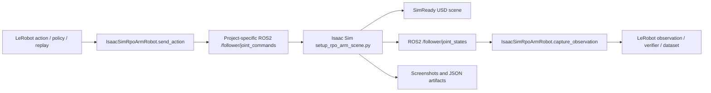

# Team Tiny Tasks: LeRobot + Isaac Sim + Arm SITL

> **For agentic workers:** REQUIRED SUB-SKILL: Use `superpowers:subagent-driven-development` (recommended) or `superpowers:executing-plans` to implement this plan task-by-task. Steps use checkbox (`- [ ]`) syntax for tracking.

**Goal:** Split the SITL project into very small tasks that a team can distribute, learn from, verify independently, and merge safely.

**Architecture:** Isaac Sim is the simulated follower. The validated SimReady USD is the scene asset. LeRobot is the robot/dataset/policy interface. Official LeRobot does not require ROS2, and Isaac Sim can run without ROS2; in this repo, ROS2 is only the chosen transport between the local `isaacsim_rpo_arm` wrapper and the Isaac Sim scene script. Every implementation task should produce either a small code diff, a runtime evidence artifact under `isaacsim_test/artifacts/`, or a documentation update explaining what changed.

**Tech Stack:** Isaac Sim 5.1 container, ROS2 Humble, local LeRobot checkout, local `isaacsim_rpo_arm` robot wrapper, Docker Compose, Python verifier scripts, SimReady USD generated from `echo_full.step`.

**Audience:** Team members who may be good developers but do not yet understand this arm project, LeRobot, Isaac Sim, ROS2, SimReady USD, or the current repo layout.

**Main rule:** Keep tasks tiny. One person should be able to finish one task, verify it, and explain it in a short standup update.

---

## 0. How to use this document

Use this file as a task board. Each task card contains:

- **Purpose:** Why the task matters.
- **Teaches:** What the assignee should learn.
- **Files:** Exact files to inspect or edit.
- **Steps:** Small checklist items.
- **Verify:** The command or evidence that proves completion.
- **Done when:** Clear acceptance criteria.
- **Suggested commit:** Commit message if the task changes files.

Recommended workflow for team leads:

1. Assign every team member one onboarding task first.
2. Then assign one implementation task from a lane.
3. Require every task to produce a short note in the PR or team chat:
   - what changed
   - how it was verified
   - what remains blocked or risky
4. Do not assign hardware-motion tasks until all SITL safety gates pass.
5. Do not merge big mixed PRs. Prefer one small task per PR or one small task per commit.

---

## 1. Current project mental model

### 1.1 What we are building

We are building a repeatable **SITL** pipeline:

```text
LeRobot action / dataset / policy
        |
        v
Local LeRobot robot wrapper: IsaacSimRpoArmRobot
        |
        |  ROS2 is used here only because this wrapper targets Isaac Sim SITL
        v
ROS2 command topic
        |
        v
Isaac Sim scene with SimReady robot arm + hand asset
        |
        v
ROS2 joint state topic + screenshots + evidence JSON
        |
        v
LeRobot observation / dataset / verification
```

SITL means **Software In The Loop**. Before moving a real robot arm, we prove the control software, data format, verifier, and simulator loop work safely in simulation.

### 1.2 The stable six-value contract

Every early task must preserve this command/state order:

| Index | Feature | Meaning | Current safe interpretation |
|---:|---|---|---|
| 0 | `right_arm_pitch_joint.pos` | Right shoulder/arm pitch | SITL command/state value |
| 1 | `right_arm_roll_joint.pos` | Right shoulder/arm roll | SITL command/state value |
| 2 | `right_arm_yaw_joint.pos` | Right shoulder/arm yaw | SITL command/state value |
| 3 | `right_elbow_pitch_joint.pos` | Right elbow pitch | SITL command/state value |
| 4 | `right_elbow_yaw_joint.pos` | Right elbow yaw | SITL command/state value |
| 5 | `amazinghand_grasp.pos` | Hand open/close intent | normalized scalar: `0.0` open, `1.0` grasp |

Do not rename these features casually. Datasets, verifiers, screenshots, and hardware parity docs depend on them.

### 1.3 Main repo paths

| Path | What it is |
|---|---|
| `docs/sitl/2026-06-27/README.md` | Current phased SITL implementation plan. |
| `docs/sitl/2026-06-27/task_separation_lerobot_isaac_sim_arm_sitl.md` | Existing high-level responsibility split. |
| `docs/sitl/2026-06-27/simready_runtime_evidence.md` | Evidence that the SimReady USD can load in Isaac Sim. |
| `isaacsim_test/docker-compose.yml` | Container orchestration for Isaac Sim, LeRobot, and related services. |
| `isaacsim_test/.env.example` | Environment variable examples for SITL. |
| `isaacsim_test/isaacsim/setup_rpo_arm_scene.py` | Isaac Sim scene setup, asset loading, ROS2 bridge behavior. |
| `isaacsim_test/lerobot/isaacsim_rpo_arm_robot.py` | Local LeRobot robot wrapper for SITL. |
| `isaacsim_test/lerobot/verify_lerobot_sitl.py` | Verification script that sends action and checks observation. |
| `isaacsim_test/lerobot/rpo_arm_isaacsim.yaml` | LeRobot SITL robot config. |
| `isaacsim_test/test_v2_roboparty_config.py` | Static/unit checks for the SITL configuration. |
| `isaacsim_test/artifacts/` | Runtime evidence output. Generated artifacts should stay out of git. |
| `arm_with_hand_with_robot_file/echo_full.step` | Source CAD file. |
| `isaacsim_test/outputs/simready/echo_full/.../echo_full_robot_arm_hand.usd` | Validated SimReady USD asset. |
| `roboparty/.../roboto_origin.urdf` | Legacy/reference RoboParty V2 URDF. |

### 1.4 Official docs team members should know

These are reference docs, not automatic implementation instructions. The local LeRobot checkout is older, so always compare official API names against local code.

- LeRobot Bring Your Own Hardware: <https://huggingface.co/docs/lerobot/en/integrate_hardware>
- LeRobotDataset v3.0: <https://huggingface.co/docs/lerobot/lerobot-dataset-v3>
- LeIsaac / EnvHub: <https://huggingface.co/docs/lerobot/envhub_leisaac>
- LeRobot processors for robots and teleoperators: <https://huggingface.co/docs/lerobot/processors_robots_teleop>
- NVIDIA skills catalog for Omniverse/Isaac guidance: <https://github.com/NVIDIA/skills>
- Direct hardware non-ROS2 guide: `docs/task_guides/08_lerobot_direct_hardware_non_ros2.md`


### 1.5 Does LeRobot use ROS2?

Short answer: **not by default, and not as an official requirement.**

Official LeRobot custom hardware docs describe a robot abstraction: define a config, expose observation/action features, connect/disconnect, read observations, and send actions. They do not require ROS2. A LeRobot robot can talk to hardware through many backends: serial, CAN, Dynamixel/Feetech buses, vendor SDKs, direct simulator APIs, ROS2, or a mock backend.

In this repo, ROS2 appears because our local SITL wrapper chose ROS2 as the transport between Python LeRobot code and Isaac Sim:

| Layer | Uses ROS2? | Why |
|---|---:|---|
| Official LeRobot concept | No required ROS2 | LeRobot only needs a robot interface with observations and actions. |
| `IsaacSimRpoArmRobot` in this repo | Yes | Publishes commands and subscribes to state topics for Isaac Sim SITL. |
| Isaac Sim scene script | Yes | Receives commands and publishes joint states. |
| Future direct hardware wrapper | Maybe | Use ROS2 only if the real hardware stack already speaks ROS2; otherwise use CAN/serial/vendor SDK directly. |

Decision rule for custom config presets:

```text
If the preset targets this Isaac Sim SITL bridge -> use ROS2 fields/topics.
If the preset targets direct RoboParty/AmazingHand hardware -> do not require ROS2 unless the hardware bringup stack uses ROS2.
If the preset targets official LeRobot-style hardware integration -> implement the LeRobot robot interface first; choose transport second.
```


### 1.6 Does Isaac Sim require ROS2?

Short answer: **no. Isaac Sim does not require ROS2 for simulation.**

NVIDIA Isaac Sim provides a ROS2 bridge/extension for ROS system integration. That means ROS2 is useful when you want Isaac Sim to publish/subscribe ROS topics, interact with ROS nodes, or validate a ROS robot stack. But Isaac Sim can also be driven through native Python APIs, extensions, OmniGraph, IsaacLab, Gym-style environments, and other direct simulator interfaces.

Official LeRobot's LeIsaac/EnvHub examples are a good contrast: they load IsaacLab/LeIsaac environments through LeRobot's environment factory and call `env.step(action)`. That flow is not the same as our local ROS2 topic bridge.

Project decision rule:

```text
Use ROS2 if the task is validating this repo's existing /follower/joint_commands and /follower/joint_states bridge.
Do not require ROS2 for generic Isaac Sim learning, rendering, physics, or IsaacLab/LeIsaac-style environment work.
If a future task migrates to LeIsaac/IsaacLab, plan it as an architecture migration instead of mixing it into tiny SITL bridge tasks.
```

### 1.7 Compatibility warning

Official LeRobot docs describe modern interfaces such as:

- `observation_features`
- `action_features`
- `get_observation()`
- `send_action()`
- `lerobot-record`

This repo currently has a local older wrapper using:

- `IsaacSimRpoArmRobot.capture_observation()`
- `IsaacSimRpoArmRobot.send_action()`
- local `lerobot/lerobot/scripts/control_robot.py`

Do not migrate APIs as part of a tiny task unless the task explicitly says it is a LeRobot upgrade task.

---

## 2. Team lanes

Use these lanes to distribute work. Each lane can have a different owner.

| Lane | Best for | Risk level | Needs Isaac Sim runtime? | Needs hardware? |
|---|---|---:|---:|---:|
| A. Onboarding and docs | New team members | Low | No | No |
| B. Static tests and repo hygiene | Python/test-focused developer | Low | No | No |
| C. LeRobot wrapper | Robotics/control developer | Medium | Sometimes | No |
| D. Isaac Sim scene | Simulation developer | Medium-high | Yes | No |
| E. ROS2/Docker bridge | Infrastructure developer | Medium | Yes | No |
| F. Evidence and screenshots | QA/tooling developer | Medium | Yes | No |
| G. Dataset record/replay | ML/data developer | Medium | Yes | No |
| H. Policy smoke | ML/control developer | Medium | Yes | No |
| I. Hardware parity and safety | Hardware lead only | High | Not always | Eventually yes |
| J. Integration QA | Senior integrator | Medium-high | Yes | No |

---

## 3. Definition of done for every task

Every task must end with one of these evidence types:

1. **Code task:** test output plus `git diff --check`.
2. **Docs task:** grep checks proving the doc is linked and contains required strings.
3. **Runtime task:** JSON evidence under `isaacsim_test/artifacts/` plus a log file.
4. **Screenshot task:** image file exists, non-empty, and is visually inspected.
5. **Hardware-prep task:** checklist updated; no real movement unless explicitly approved by the hardware lead.

Minimum verification for most non-runtime tasks:

```bash
python3 isaacsim_test/test_v2_roboparty_config.py
python3 -m py_compile isaacsim_test/isaacsim/setup_rpo_arm_scene.py isaacsim_test/lerobot/verify_lerobot_sitl.py isaacsim_test/test_v2_roboparty_config.py
git diff --check
```

Minimum verification for Isaac Sim behavior tasks:

```bash
cd isaacsim_test
bash run_lerobot_sitl_check.sh
```

Expected runtime evidence:

```text
isaacsim_test/artifacts/lerobot_sitl_verify.json
isaacsim_test/artifacts/rpo_v2_lerobot_target.png or newer screenshot path
isaacsim_test/artifacts/isaac-sim-51.log
isaacsim_test/artifacts/lerobot-sitl.log
```

---

## 4. Suggested dependency map

Do not start all tasks at once. Use this flow:

```text
Onboarding tasks
  -> static tests and docs tasks
  -> one-command SITL task
  -> sweep verifier task
  -> screenshot/evidence task
  -> physics/limit task
  -> SimReady binding tasks
  -> record/replay tasks
  -> policy smoke tasks
  -> hardware parity tasks
```

Parallel-safe examples:

- One person can write docs while another writes static tests.
- One person can inspect LeRobot wrapper while another inspects Docker Compose.
- One person can build dataset schema checks while another builds screenshot validation.

Not parallel-safe examples:

- Two people editing `setup_rpo_arm_scene.py` at the same time.
- Two people changing the six-feature contract at the same time.
- Hardware motion before SITL gates are verified.

---

# 5. Tiny task cards

## Lane A: Onboarding and project understanding

### A01 — Read the SITL README and make a glossary

**Purpose:** Help a new member understand the project language.

**Teaches:** SITL, SimReady, LeRobot, ROS2, verifier, artifacts.

**Files:**
- Read: `docs/sitl/2026-06-27/README.md`
- Create: `docs/sitl/2026-06-27/team_notes/glossary_<name>.md`

**Steps:**

- [ ] Create directory:

```bash
mkdir -p docs/sitl/2026-06-27/team_notes
```

- [ ] Create a glossary file with these headings:

```markdown
# SITL Glossary - <name>

## Terms I learned

| Term | Meaning in this project | File where I saw it |
|---|---|---|
| SITL | Software in the loop; simulator verifies software before hardware. | docs/sitl/2026-06-27/README.md |

## Questions for team lead

- 
```

- [ ] Fill at least 15 terms.
- [ ] Add at least 3 questions if anything is unclear.

**Verify:**

```bash
grep -n "| SITL |" docs/sitl/2026-06-27/team_notes/glossary_<name>.md
git diff --check
```

**Done when:** The glossary has at least 15 rows and no markdown whitespace errors.

**Suggested commit:**

```bash
git add docs/sitl/2026-06-27/team_notes/glossary_<name>.md
git commit -m "docs: add SITL glossary notes for <name>"
```

---

### A02 — Explain the six-feature contract in plain language

**Purpose:** Make sure every team member understands the most important interface.

**Teaches:** Feature order, action vectors, observation vectors, hand scalar.

**Files:**
- Read: `docs/sitl/2026-06-27/task_separation_lerobot_isaac_sim_arm_sitl.md`
- Create: `docs/sitl/2026-06-27/team_notes/six_feature_contract_<name>.md`

**Steps:**

- [ ] Copy this template:

```markdown
# Six Feature Contract - <name>

## The contract

The SITL project currently sends and reads exactly 6 values in this order:

1. `right_arm_pitch_joint.pos`
2. `right_arm_roll_joint.pos`
3. `right_arm_yaw_joint.pos`
4. `right_elbow_pitch_joint.pos`
5. `right_elbow_yaw_joint.pos`
6. `amazinghand_grasp.pos`

## My explanation

<Write 1-2 sentences for each feature.>

## Why order matters

<Explain what can break if the order changes.>
```

- [ ] Fill the explanation section.
- [ ] Add one example action vector:

```text
[0.2, 0.1, -0.2, 0.3, 0.1, 0.5]
```

**Verify:**

```bash
grep -n "right_arm_pitch_joint.pos" docs/sitl/2026-06-27/team_notes/six_feature_contract_<name>.md
grep -n "amazinghand_grasp.pos" docs/sitl/2026-06-27/team_notes/six_feature_contract_<name>.md
git diff --check
```

**Done when:** The note explains all 6 values and why order matters.

**Suggested commit:**

```bash
git add docs/sitl/2026-06-27/team_notes/six_feature_contract_<name>.md
git commit -m "docs: explain SITL six feature contract"
```

---

### A03 — Draw the SITL data flow as Mermaid

**Purpose:** Give the team a shared picture of the system.

**Teaches:** Data flow from LeRobot to the local wrapper, then through this repo's ROS2 bridge to Isaac Sim and back.

**Files:**
- Create: `docs/sitl/2026-06-27/team_notes/sitl_data_flow.md`

**Steps:**

- [ ] Create this markdown file:

````markdown
# SITL Data Flow



## Notes

- LeRobot should not be bypassed by tests that are meant to validate LeRobot behavior.
- Runtime evidence belongs under `isaacsim_test/artifacts/`.
````

**Verify:**

```bash
grep -n "flowchart LR" docs/sitl/2026-06-27/team_notes/sitl_data_flow.md
grep -n "send_action" docs/sitl/2026-06-27/team_notes/sitl_data_flow.md
git diff --check
```

**Done when:** The diagram renders in markdown viewers that support Mermaid.

**Suggested commit:**

```bash
git add docs/sitl/2026-06-27/team_notes/sitl_data_flow.md
git commit -m "docs: add SITL data flow diagram"
```

---

### A04 — Summarize official LeRobot hardware docs

**Purpose:** Teach the team the intended LeRobot robot abstraction.

**Teaches:** Robot class boundary, observation features, action features, connection lifecycle.

**Files:**
- Read: <https://huggingface.co/docs/lerobot/en/integrate_hardware>
- Create: `docs/sitl/2026-06-27/team_notes/lerobot_hardware_docs_summary_<name>.md`

**Steps:**

- [ ] Read the official page.
- [ ] Create a summary with this template:

```markdown
# LeRobot Hardware Docs Summary - <name>

Source: https://huggingface.co/docs/lerobot/en/integrate_hardware

## What LeRobot expects from a robot

- Observation features:
- Action features:
- Connect/disconnect behavior:
- Reading observations:
- Sending actions:

## How our repo is similar

- 

## How our repo is different

- 

## Risks if we upgrade LeRobot later

- 
```

- [ ] Fill every bullet with project-specific notes.

**Verify:**

```bash
grep -n "Observation features" docs/sitl/2026-06-27/team_notes/lerobot_hardware_docs_summary_<name>.md
grep -n "How our repo is different" docs/sitl/2026-06-27/team_notes/lerobot_hardware_docs_summary_<name>.md
git diff --check
```

**Done when:** The summary compares official LeRobot docs to this repo.

**Suggested commit:**

```bash
git add docs/sitl/2026-06-27/team_notes/lerobot_hardware_docs_summary_<name>.md
git commit -m "docs: summarize LeRobot hardware interface docs"
```

---

### A05 — Summarize official LeRobotDataset docs

**Purpose:** Prepare ML/data members for recording and replay tasks.

**Teaches:** `observation.state`, `action`, metadata, dataset layout, Hub compatibility.

**Files:**
- Read: <https://huggingface.co/docs/lerobot/lerobot-dataset-v3>
- Create: `docs/sitl/2026-06-27/team_notes/lerobot_dataset_docs_summary_<name>.md`

**Steps:**

- [ ] Read the official page.
- [ ] Create this summary:

```markdown
# LeRobotDataset Docs Summary - <name>

Source: https://huggingface.co/docs/lerobot/lerobot-dataset-v3

## Dataset fields important to this project

| Field | Meaning | How SITL should produce it |
|---|---|---|
| `observation.state` | Robot state vector. | Six-feature state from IsaacSimRpoArmRobot. |
| `action` | Robot command vector. | Six-feature action sent through send_action. |

## What we should record first

- One tiny deterministic SITL episode.
- Shape `(6,)` for `observation.state`.
- Shape `(6,)` for `action`.

## What we should not add yet

- Multi-DOF hand representation.
- Unreviewed camera-heavy datasets.
- Real hardware data before safety gates.
```

**Verify:**

```bash
grep -n "observation.state" docs/sitl/2026-06-27/team_notes/lerobot_dataset_docs_summary_<name>.md
grep -n "action" docs/sitl/2026-06-27/team_notes/lerobot_dataset_docs_summary_<name>.md
git diff --check
```

**Done when:** Dataset notes clearly say the first SITL dataset is six-dimensional.

**Suggested commit:**

```bash
git add docs/sitl/2026-06-27/team_notes/lerobot_dataset_docs_summary_<name>.md
git commit -m "docs: summarize LeRobot dataset guidance for SITL"
```

---

### A06 — Inspect current local LeRobot version and layout

**Purpose:** Prevent team members from blindly following docs for a newer API.

**Teaches:** Local code truth beats assumptions.

**Files:**
- Inspect: `lerobot/pyproject.toml`
- Inspect: `lerobot/lerobot/scripts/control_robot.py`
- Inspect: `isaacsim_test/lerobot/isaacsim_rpo_arm_robot.py`
- Create: `docs/sitl/2026-06-27/team_notes/local_lerobot_layout_<name>.md`

**Steps:**

- [ ] Run:

```bash
git -C lerobot rev-parse --short HEAD
grep -n "version" lerobot/pyproject.toml | head
grep -R "class Robot" -n lerobot/lerobot/common/robot_devices/robots | head
```

- [ ] Record the outputs in the note.
- [ ] Add a section explaining why local code may differ from official docs.

**Verify:**

```bash
grep -n "pyproject.toml" docs/sitl/2026-06-27/team_notes/local_lerobot_layout_<name>.md
grep -n "control_robot.py" docs/sitl/2026-06-27/team_notes/local_lerobot_layout_<name>.md
git diff --check
```

**Done when:** The note names the local LeRobot version/layout and warns about API drift.

**Suggested commit:**

```bash
git add docs/sitl/2026-06-27/team_notes/local_lerobot_layout_<name>.md
git commit -m "docs: record local LeRobot layout notes"
```

---

## Lane B: Static tests and repo hygiene

### B01 — Add a docs link test for the team task file

**Purpose:** Make sure the team task document stays discoverable.

**Teaches:** Static docs regression checks.

**Files:**
- Modify: `isaacsim_test/test_v2_roboparty_config.py`
- Read: `docs/sitl/2026-06-27/README.md`

**Steps:**

- [ ] Add a test method to `test_v2_roboparty_config.py`:

```python
def test_sitl_team_task_docs_are_linked(self):
    readme = _read("docs/sitl/2026-06-27/README.md")
    self.assertIn("team_tiny_tasks_sitl.md", readme)
    team_doc = _read("docs/sitl/2026-06-27/team_tiny_tasks_sitl.md")
    self.assertIn("right_arm_pitch_joint.pos", team_doc)
    self.assertIn("LeRobot", team_doc)
    self.assertIn("Isaac Sim", team_doc)
```

- [ ] Run the test before adding the README link if not already linked.
- [ ] Add the README link if needed.

**Verify:**

```bash
python3 isaacsim_test/test_v2_roboparty_config.py
git diff --check
```

**Done when:** Static tests pass and the new team task doc is linked.

**Suggested commit:**

```bash
git add isaacsim_test/test_v2_roboparty_config.py docs/sitl/2026-06-27/README.md
git commit -m "test: require SITL team task docs link"
```

---

### B02 — Add a static test for the six-feature order

**Purpose:** Prevent accidental reordering of the action/state contract.

**Teaches:** Contract testing for robotics interfaces.

**Files:**
- Modify: `isaacsim_test/test_v2_roboparty_config.py`
- Read: `isaacsim_test/lerobot/isaacsim_rpo_arm_robot.py`

**Steps:**

- [ ] Add this expected list in the test file if it is not already present:

```python
EXPECTED_FEATURE_ORDER = [
    "right_arm_pitch_joint",
    "right_arm_roll_joint",
    "right_arm_yaw_joint",
    "right_elbow_pitch_joint",
    "right_elbow_yaw_joint",
    "amazinghand_grasp",
]
```

- [ ] Add a test that reads the wrapper and config:

```python
def test_lerobot_feature_order_contract(self):
    robot_text = _read("isaacsim_test/lerobot/isaacsim_rpo_arm_robot.py")
    yaml_text = _read("isaacsim_test/lerobot/rpo_arm_isaacsim.yaml")
    for name in EXPECTED_FEATURE_ORDER:
        self.assertIn(name, robot_text)
        self.assertIn(name, yaml_text)
```

**Verify:**

```bash
python3 isaacsim_test/test_v2_roboparty_config.py
git diff --check
```

**Done when:** Test fails if any expected feature disappears from wrapper/config.

**Suggested commit:**

```bash
git add isaacsim_test/test_v2_roboparty_config.py
git commit -m "test: lock LeRobot SITL feature names"
```

---

### B03 — Add a static test for artifact hygiene

**Purpose:** Keep generated runtime outputs out of source control.

**Teaches:** Artifact boundaries.

**Files:**
- Modify: `isaacsim_test/test_v2_roboparty_config.py`
- Read: `.gitignore`

**Steps:**

- [ ] Add a test:

```python
def test_runtime_artifacts_are_gitignored(self):
    gitignore = _read(".gitignore")
    self.assertIn("isaacsim_test/artifacts/", gitignore)
```

- [ ] If the ignore rule is missing, add exactly this line to `.gitignore`:

```gitignore
isaacsim_test/artifacts/
```

**Verify:**

```bash
python3 isaacsim_test/test_v2_roboparty_config.py
git check-ignore isaacsim_test/artifacts/example.json
git diff --check
```

Expected `git check-ignore` output:

```text
isaacsim_test/artifacts/example.json
```

**Done when:** Test passes and a fake artifact path is ignored.

**Suggested commit:**

```bash
git add .gitignore isaacsim_test/test_v2_roboparty_config.py
git commit -m "test: enforce SITL artifact ignore rule"
```

---

### B04 — Add a static test for SimReady USD environment variable

**Purpose:** Ensure future container changes keep the SimReady asset configurable.

**Teaches:** Environment-driven simulator configuration.

**Files:**
- Modify: `isaacsim_test/test_v2_roboparty_config.py`
- Read: `isaacsim_test/docker-compose.yml`
- Read: `isaacsim_test/.env.example`

**Steps:**

- [ ] Add a test:

```python
def test_simready_usd_path_is_configured(self):
    compose = _read("isaacsim_test/docker-compose.yml")
    env_example = _read("isaacsim_test/.env.example")
    self.assertIn("SIMREADY_USD_PATH", compose)
    self.assertIn("SIMREADY_USD_PATH", env_example)
    self.assertIn("echo_full_robot_arm_hand.usd", compose)
    self.assertIn("echo_full_robot_arm_hand.usd", env_example)
```

**Verify:**

```bash
python3 isaacsim_test/test_v2_roboparty_config.py
git diff --check
```

**Done when:** Test protects the SimReady USD default path.

**Suggested commit:**

```bash
git add isaacsim_test/test_v2_roboparty_config.py
git commit -m "test: require SimReady USD configuration"
```

---

### B05 — Add py_compile verification script

**Purpose:** Give team members one easy local syntax check.

**Teaches:** Fast pre-runtime validation.

**Files:**
- Create: `isaacsim_test/check_python_syntax.sh`
- Modify: `isaacsim_test/README.md`
- Modify: `isaacsim_test/test_v2_roboparty_config.py`

**Steps:**

- [ ] Create `isaacsim_test/check_python_syntax.sh`:

```bash
#!/usr/bin/env bash
set -euo pipefail
cd "$(dirname "$0")/.."
python3 -m py_compile \
  isaacsim_test/isaacsim/setup_rpo_arm_scene.py \
  isaacsim_test/lerobot/isaacsim_rpo_arm_robot.py \
  isaacsim_test/lerobot/verify_lerobot_sitl.py \
  isaacsim_test/test_v2_roboparty_config.py
```

- [ ] Make it executable:

```bash
chmod +x isaacsim_test/check_python_syntax.sh
```

- [ ] Add a static test:

```python
def test_python_syntax_check_script_exists(self):
    script = _read("isaacsim_test/check_python_syntax.sh")
    self.assertIn("py_compile", script)
    self.assertIn("setup_rpo_arm_scene.py", script)
    self.assertIn("verify_lerobot_sitl.py", script)
```

- [ ] Add this command to `isaacsim_test/README.md` under verification gates:

```bash
./check_python_syntax.sh
```

**Verify:**

```bash
python3 isaacsim_test/test_v2_roboparty_config.py
isaacsim_test/check_python_syntax.sh
git diff --check
```

**Done when:** The script runs and static tests mention it.

**Suggested commit:**

```bash
git add isaacsim_test/check_python_syntax.sh isaacsim_test/README.md isaacsim_test/test_v2_roboparty_config.py
git commit -m "test: add SITL Python syntax check script"
```

---

## Lane C: LeRobot wrapper tasks

### C01 — Document the current wrapper API

**Purpose:** Teach developers where LeRobot enters the SITL loop.

**Teaches:** `connect()`, `send_action()`, `capture_observation()`, `disconnect()`.

**Files:**
- Read: `isaacsim_test/lerobot/isaacsim_rpo_arm_robot.py`
- Create: `docs/sitl/2026-06-27/lerobot_wrapper_api.md`

**Steps:**

- [ ] Create a doc with this structure:

```markdown
# Local LeRobot SITL Wrapper API

## File

`isaacsim_test/lerobot/isaacsim_rpo_arm_robot.py`

## Robot type

`isaacsim_rpo_arm`

## Lifecycle

1. Create `IsaacSimRpoArmConfig`.
2. Create `IsaacSimRpoArmRobot(config)`.
3. Call `connect()`.
4. Call `send_action(action)`.
5. Call `capture_observation()`.
6. Call `disconnect()`.

## Feature keys

- `right_arm_pitch_joint.pos`
- `right_arm_roll_joint.pos`
- `right_arm_yaw_joint.pos`
- `right_elbow_pitch_joint.pos`
- `right_elbow_yaw_joint.pos`
- `amazinghand_grasp.pos`

## Important warning

Tests that validate this project's LeRobot SITL behavior must use `send_action()` instead of directly publishing ROS2 messages. Official LeRobot itself does not require ROS2.
```

**Verify:**

```bash
grep -n "send_action" docs/sitl/2026-06-27/lerobot_wrapper_api.md
grep -n "capture_observation" docs/sitl/2026-06-27/lerobot_wrapper_api.md
git diff --check
```

**Done when:** A new member can read the doc and know which methods to call.

**Suggested commit:**

```bash
git add docs/sitl/2026-06-27/lerobot_wrapper_api.md
git commit -m "docs: describe local LeRobot SITL wrapper API"
```

---

### C02 — Add a mock-mode unit test for wrapper observation shape

**Purpose:** Check wrapper output shape without starting ROS2 or Isaac Sim.

**Teaches:** Fast local tests for LeRobot wrapper behavior.

**Files:**
- Modify: `isaacsim_test/test_v2_roboparty_config.py`
- Read: `isaacsim_test/lerobot/isaacsim_rpo_arm_robot.py`

**Steps:**

- [ ] Add import setup if needed so tests can import the local wrapper.
- [ ] Add this test:

```python
def test_mock_robot_observation_shape_is_six(self):
    import sys
    from pathlib import Path

    wrapper_dir = Path("isaacsim_test/lerobot").resolve()
    if str(wrapper_dir) not in sys.path:
        sys.path.insert(0, str(wrapper_dir))

    from isaacsim_rpo_arm_robot import IsaacSimRpoArmConfig, IsaacSimRpoArmRobot

    config = IsaacSimRpoArmConfig(mock=True)
    robot = IsaacSimRpoArmRobot(config)
    robot.connect()
    try:
        obs = robot.capture_observation()
        self.assertIn("observation.state", obs)
        self.assertEqual(tuple(obs["observation.state"].shape), (6,))
    finally:
        robot.disconnect()
```

**Verify:**

```bash
python3 isaacsim_test/test_v2_roboparty_config.py
git diff --check
```

**Done when:** Mock robot observation shape is tested without Isaac Sim.

**Suggested commit:**

```bash
git add isaacsim_test/test_v2_roboparty_config.py
git commit -m "test: verify mock LeRobot observation shape"
```

---

### C03 — Add a mock-mode unit test for hand grasp clipping

**Purpose:** Make sure unsafe hand values are clipped to `[0.0, 1.0]`.

**Teaches:** Safety clamping for action vectors.

**Files:**
- Modify: `isaacsim_test/test_v2_roboparty_config.py`

**Steps:**

- [ ] Add this test:

```python
def test_mock_robot_clips_hand_grasp_action(self):
    import sys
    from pathlib import Path

    wrapper_dir = Path("isaacsim_test/lerobot").resolve()
    if str(wrapper_dir) not in sys.path:
        sys.path.insert(0, str(wrapper_dir))

    from isaacsim_rpo_arm_robot import IsaacSimRpoArmConfig, IsaacSimRpoArmRobot

    config = IsaacSimRpoArmConfig(mock=True)
    robot = IsaacSimRpoArmRobot(config)
    robot.connect()
    try:
        high = robot.send_action([0, 0, 0, 0, 0, 2.5])
        low = robot.send_action([0, 0, 0, 0, 0, -2.5])
        self.assertEqual(float(high[-1]), 1.0)
        self.assertEqual(float(low[-1]), 0.0)
    finally:
        robot.disconnect()
```

**Verify:**

```bash
python3 isaacsim_test/test_v2_roboparty_config.py
git diff --check
```

**Done when:** Test proves hand scalar cannot exceed safe range in the wrapper.

**Suggested commit:**

```bash
git add isaacsim_test/test_v2_roboparty_config.py
git commit -m "test: verify SITL hand grasp clipping"
```

---

### C04 — Add a mock-mode unit test for short action padding

**Purpose:** Ensure short action arrays cannot crash or produce wrong length commands.

**Teaches:** Defensive vector normalization.

**Files:**
- Modify: `isaacsim_test/test_v2_roboparty_config.py`

**Steps:**

- [ ] Add this test:

```python
def test_mock_robot_pads_short_action_to_six_values(self):
    import sys
    from pathlib import Path

    wrapper_dir = Path("isaacsim_test/lerobot").resolve()
    if str(wrapper_dir) not in sys.path:
        sys.path.insert(0, str(wrapper_dir))

    from isaacsim_rpo_arm_robot import IsaacSimRpoArmConfig, IsaacSimRpoArmRobot

    config = IsaacSimRpoArmConfig(mock=True)
    robot = IsaacSimRpoArmRobot(config)
    robot.connect()
    try:
        sent = robot.send_action([0.1, 0.2])
        self.assertEqual(tuple(sent.shape), (6,))
        self.assertEqual(float(sent[0]), 0.1)
        self.assertEqual(float(sent[1]), 0.2)
        self.assertEqual(float(sent[5]), 0.0)
    finally:
        robot.disconnect()
```

**Verify:**

```bash
python3 isaacsim_test/test_v2_roboparty_config.py
git diff --check
```

**Done when:** Short actions are padded safely.

**Suggested commit:**

```bash
git add isaacsim_test/test_v2_roboparty_config.py
git commit -m "test: verify SITL action vector padding"
```

---

### C05 — Add a mock-mode unit test for long action truncation

**Purpose:** Ensure extra values do not silently extend the contract.

**Teaches:** Contract enforcement.

**Files:**
- Modify: `isaacsim_test/test_v2_roboparty_config.py`

**Steps:**

- [ ] Add this test:

```python
def test_mock_robot_truncates_long_action_to_six_values(self):
    import sys
    from pathlib import Path

    wrapper_dir = Path("isaacsim_test/lerobot").resolve()
    if str(wrapper_dir) not in sys.path:
        sys.path.insert(0, str(wrapper_dir))

    from isaacsim_rpo_arm_robot import IsaacSimRpoArmConfig, IsaacSimRpoArmRobot

    config = IsaacSimRpoArmConfig(mock=True)
    robot = IsaacSimRpoArmRobot(config)
    robot.connect()
    try:
        sent = robot.send_action([0, 1, 2, 3, 4, 0.5, 99, 100])
        self.assertEqual(tuple(sent.shape), (6,))
        self.assertEqual(float(sent[-1]), 0.5)
    finally:
        robot.disconnect()
```

**Verify:**

```bash
python3 isaacsim_test/test_v2_roboparty_config.py
git diff --check
```

**Done when:** The wrapper cannot accidentally become an 8D command interface.

**Suggested commit:**

```bash
git add isaacsim_test/test_v2_roboparty_config.py
git commit -m "test: verify SITL action vector truncation"
```

---

### C06 — Add a wrapper feature metadata test

**Purpose:** Verify LeRobot dataset metadata will advertise shape `(6,)`.

**Teaches:** How LeRobot sees robot features.

**Files:**
- Modify: `isaacsim_test/test_v2_roboparty_config.py`

**Steps:**

- [ ] Add this test:

```python
def test_mock_robot_feature_metadata_shape(self):
    import sys
    from pathlib import Path

    wrapper_dir = Path("isaacsim_test/lerobot").resolve()
    if str(wrapper_dir) not in sys.path:
        sys.path.insert(0, str(wrapper_dir))

    from isaacsim_rpo_arm_robot import IsaacSimRpoArmConfig, IsaacSimRpoArmRobot

    robot = IsaacSimRpoArmRobot(IsaacSimRpoArmConfig(mock=True))
    features = robot.features
    self.assertEqual(tuple(features["observation.state"]["shape"]), (6,))
    self.assertEqual(tuple(features["action"]["shape"]), (6,))
    self.assertEqual(features["action"]["names"][-1], "amazinghand_grasp.pos")
```

**Verify:**

```bash
python3 isaacsim_test/test_v2_roboparty_config.py
git diff --check
```

**Done when:** Feature metadata matches the six-feature contract.

**Suggested commit:**

```bash
git add isaacsim_test/test_v2_roboparty_config.py
git commit -m "test: verify LeRobot SITL feature metadata"
```

---

## Lane D: Isaac Sim scene and SimReady tasks

### D01 — Document SimReady asset source of truth

**Purpose:** Stop team members from using the wrong robot asset.

**Teaches:** CAD to SimReady asset lineage.

**Files:**
- Create: `docs/sitl/2026-06-27/simready_asset_source_of_truth.md`
- Read: `docs/sitl/2026-06-27/simready_runtime_evidence.md`

**Steps:**

- [ ] Create this document:

```markdown
# SimReady Asset Source of Truth

## Source CAD

`arm_with_hand_with_robot_file/echo_full.step`

## Validated SimReady USD

`isaacsim_test/outputs/simready/echo_full/pipeline/04_conform/repair-loop-02-fet005/fet005-grasp/echo_full_robot_arm_hand.usd`

## Current runtime evidence

See `docs/sitl/2026-06-27/simready_runtime_evidence.md`.

## Rule

New SITL work should load the SimReady USD by default. The RoboParty V2 URDF is a legacy/reference source for joint names and should not become the default visual asset again without a documented reason.
```

**Verify:**

```bash
grep -n "echo_full_robot_arm_hand.usd" docs/sitl/2026-06-27/simready_asset_source_of_truth.md
grep -n "legacy/reference" docs/sitl/2026-06-27/simready_asset_source_of_truth.md
git diff --check
```

**Done when:** The asset path and rule are documented.

**Suggested commit:**

```bash
git add docs/sitl/2026-06-27/simready_asset_source_of_truth.md
git commit -m "docs: record SimReady SITL asset source of truth"
```

---

### D02 — Add a static test that the scene logs SimReady loading

**Purpose:** Ensure Isaac Sim startup remains auditable.

**Teaches:** Runtime log contracts.

**Files:**
- Modify: `isaacsim_test/test_v2_roboparty_config.py`
- Read: `isaacsim_test/isaacsim/setup_rpo_arm_scene.py`

**Steps:**

- [ ] Add this test:

```python
def test_scene_logs_simready_usd_loading(self):
    scene = _read("isaacsim_test/isaacsim/setup_rpo_arm_scene.py")
    self.assertIn("SIMREADY_USD_PATH", scene)
    self.assertIn("Loading SimReady USD", scene)
    self.assertIn("simready_prim_mapping.json", scene)
```

**Verify:**

```bash
python3 isaacsim_test/test_v2_roboparty_config.py
git diff --check
```

**Done when:** Static test protects SimReady loading evidence hooks.

**Suggested commit:**

```bash
git add isaacsim_test/test_v2_roboparty_config.py
git commit -m "test: require SimReady scene loading evidence"
```

---

### D03 — Create a prim mapping schema document

**Purpose:** Teach what `simready_prim_mapping.json` means.

**Teaches:** Binding evidence and `binding_pending` status.

**Files:**
- Create: `docs/sitl/2026-06-27/simready_prim_mapping_schema.md`
- Read: `isaacsim_test/artifacts/simready_prim_mapping.json` if present

**Steps:**

- [ ] Create this document:

```markdown
# SimReady Prim Mapping Schema

## Purpose

`simready_prim_mapping.json` explains how the six LeRobot features relate to USD prims or articulation controls in Isaac Sim.

## Required fields

| Field | Meaning |
|---|---|
| `asset` | Name or path of the loaded SimReady USD. |
| `control_contract` | The six LeRobot feature names in order. |
| `binding_status` | Overall status. Use `binding_pending` until real controls are verified. |
| `feature_bindings` | Per-feature binding details if available. |
| `prim_hierarchy` | Captured USD prim list for inspection. |

## Status values

| Status | Meaning |
|---|---|
| `bound` | The feature drives or reads a real USD/articulation target. |
| `binding_pending` | The feature is known but not yet attached to a real control. |
| `not_applicable` | The feature does not need a USD binding. Use rarely and explain why. |

## Rule

Do not replace `binding_pending` with `bound` unless a runtime test proves motion/state behavior.
```

**Verify:**

```bash
grep -n "binding_pending" docs/sitl/2026-06-27/simready_prim_mapping_schema.md
grep -n "control_contract" docs/sitl/2026-06-27/simready_prim_mapping_schema.md
git diff --check
```

**Done when:** The schema doc explains required fields and statuses.

**Suggested commit:**

```bash
git add docs/sitl/2026-06-27/simready_prim_mapping_schema.md
git commit -m "docs: define SimReady prim mapping evidence schema"
```

---

### D04 — Add a static test for prim mapping required fields

**Purpose:** Ensure the scene script keeps writing useful mapping evidence.

**Teaches:** Evidence schema testing.

**Files:**
- Modify: `isaacsim_test/test_v2_roboparty_config.py`
- Read: `isaacsim_test/isaacsim/setup_rpo_arm_scene.py`

**Steps:**

- [ ] Add this test:

```python
def test_scene_prim_mapping_schema_fields_exist(self):
    scene = _read("isaacsim_test/isaacsim/setup_rpo_arm_scene.py")
    for field in ["asset", "control_contract", "binding_status"]:
        self.assertIn(field, scene)
    for feature in FEATURE_JOINTS:
        self.assertIn(f"{feature}.pos", scene)
```

**Verify:**

```bash
python3 isaacsim_test/test_v2_roboparty_config.py
git diff --check
```

**Done when:** Static test catches accidental removal of mapping fields.

**Suggested commit:**

```bash
git add isaacsim_test/test_v2_roboparty_config.py
git commit -m "test: require SimReady prim mapping schema fields"
```

---

### D05 — Create an Isaac Sim runtime checklist

**Purpose:** Give simulator operators a repeatable runbook.

**Teaches:** How to start, inspect, and stop Isaac Sim SITL.

**Files:**
- Create: `docs/sitl/2026-06-27/isaac_sim_runtime_checklist.md`

**Steps:**

- [ ] Create this checklist:

````markdown
# Isaac Sim Runtime Checklist

## Before starting

- [ ] NVIDIA GPU is available.
- [ ] Docker can run GPU containers.
- [ ] `isaacsim_test/.env` exists or `.env.example` is understood.
- [ ] `SIMREADY_USD_PATH` points to `echo_full_robot_arm_hand.usd`.
- [ ] Runtime artifacts under `isaacsim_test/artifacts/` may be deleted safely.

## Start command

```bash
cd isaacsim_test
docker compose up --force-recreate isaac-sim-51
```

## Expected evidence

- [ ] Isaac log mentions `Loading SimReady USD`.
- [ ] `simready_prim_mapping.json` is written.
- [ ] A screenshot is written when screenshot environment variables are enabled.

## Stop command

```bash
cd isaacsim_test
docker compose rm -sf isaac-sim-51 lerobot foxglove
```
````

**Verify:**

```bash
grep -n "Loading SimReady USD" docs/sitl/2026-06-27/isaac_sim_runtime_checklist.md
grep -n "docker compose" docs/sitl/2026-06-27/isaac_sim_runtime_checklist.md
git diff --check
```

**Done when:** A new operator can follow the checklist without guessing commands.

**Suggested commit:**

```bash
git add docs/sitl/2026-06-27/isaac_sim_runtime_checklist.md
git commit -m "docs: add Isaac Sim SITL runtime checklist"
```

---

## Lane E: Project-specific ROS2 and Docker bridge tasks

### E01 — Document project-specific ROS2 topics used by SITL

**Purpose:** Make transport boundaries explicit.

**Teaches:** Which topics carry commands and state.

**Files:**
- Read: `isaacsim_test/lerobot/isaacsim_rpo_arm_robot.py`
- Read: `isaacsim_test/docker-compose.yml`
- Create: `docs/sitl/2026-06-27/ros2_topic_contract.md`

**Steps:**

- [ ] Create this document:

```markdown
# Project-Specific ROS2 Topic Contract for SITL

## Domain

Default `ROS_DOMAIN_ID`: `42`

## Topics

| Topic | Message type | Direction | Meaning |
|---|---|---|---|
| `/follower/joint_commands` | `std_msgs/msg/Float64MultiArray` | LeRobot -> Isaac Sim | Six-value command vector. |
| `/follower/joint_states` | `sensor_msgs/msg/JointState` | Isaac Sim -> LeRobot | Joint state feedback. |
| `/leader/joint_commands` | `std_msgs/msg/Float64MultiArray` | Phone/teleop -> LeRobot wrapper | Optional teleop command source. |

## Rule

Verifier and dataset replay tasks should call `IsaacSimRpoArmRobot.send_action()` instead of publishing directly to `/follower/joint_commands`.
```

**Verify:**

```bash
grep -n "/follower/joint_commands" docs/sitl/2026-06-27/ros2_topic_contract.md
grep -n "ROS_DOMAIN_ID" docs/sitl/2026-06-27/ros2_topic_contract.md
git diff --check
```

**Done when:** Transport topics are documented clearly.

**Suggested commit:**

```bash
git add docs/sitl/2026-06-27/ros2_topic_contract.md
git commit -m "docs: define ROS2 SITL topic contract"
```

---

### E02 — Add static test for project-specific ROS2 topic names

**Purpose:** Prevent silent topic name drift.

**Teaches:** Topic contracts as tests.

**Files:**
- Modify: `isaacsim_test/test_v2_roboparty_config.py`

**Steps:**

- [ ] Add this test:

```python
def test_ros2_topic_names_are_stable(self):
    robot = _read("isaacsim_test/lerobot/isaacsim_rpo_arm_robot.py")
    config = _read("isaacsim_test/lerobot/rpo_arm_isaacsim.yaml")
    for topic in ["/follower/joint_states", "/follower/joint_commands", "/leader/joint_commands"]:
        self.assertIn(topic, robot + config)
```

**Verify:**

```bash
python3 isaacsim_test/test_v2_roboparty_config.py
git diff --check
```

**Done when:** Tests catch accidental topic changes.

**Suggested commit:**

```bash
git add isaacsim_test/test_v2_roboparty_config.py
git commit -m "test: lock SITL ROS2 topic names"
```

---

### E03 — Document Docker Compose service responsibilities

**Purpose:** Make container roles obvious to new team members.

**Teaches:** Isaac Sim service vs LeRobot service vs visualization service.

**Files:**
- Read: `isaacsim_test/docker-compose.yml`
- Create: `docs/sitl/2026-06-27/docker_compose_services.md`

**Steps:**

- [ ] Create this document:

```markdown
# Docker Compose Services for SITL

## Services

| Service | Responsibility | Usually started by |
|---|---|---|
| `isaac-sim-51` | Runs Isaac Sim 5.1 scene and ROS2 bridge. | SITL run script or manual runtime command. |
| `lerobot` | Runs LeRobot verifier, record, replay, and policy scripts. | One-command SITL script or manual test command. |
| `foxglove` | Optional ROS visualization/debug UI. | Manual debugging only. |

## Rule

Automated verification should clean old containers before a new run so stale ROS2 state does not hide failures.
```

**Verify:**

```bash
grep -n "isaac-sim-51" docs/sitl/2026-06-27/docker_compose_services.md
grep -n "lerobot" docs/sitl/2026-06-27/docker_compose_services.md
git diff --check
```

**Done when:** Service roles are documented.

**Suggested commit:**

```bash
git add docs/sitl/2026-06-27/docker_compose_services.md
git commit -m "docs: explain SITL Docker Compose services"
```

---

### E04 — Add a static test for one-command bringup script contents

**Purpose:** Make sure the one-command gate remains complete.

**Teaches:** Script-level regression checks.

**Files:**
- Modify: `isaacsim_test/test_v2_roboparty_config.py`
- Create or read: `isaacsim_test/run_lerobot_sitl_check.sh`

**Steps:**

- [ ] Add this test:

```python
def test_one_command_sitl_script_contract(self):
    script = _read("isaacsim_test/run_lerobot_sitl_check.sh")
    self.assertIn("docker compose up --force-recreate isaac-sim-51", script)
    self.assertIn("verify_lerobot_sitl.py", script)
    self.assertIn("lerobot_sitl_verify.json", script)
    self.assertIn("SCREENSHOT", script)
    self.assertIn("docker compose rm -sf", script)
```

- [ ] If the script does not exist yet, implement it according to `docs/sitl/2026-06-27/README.md` Task 1.

**Verify:**

```bash
python3 isaacsim_test/test_v2_roboparty_config.py
git diff --check
```

**Done when:** Test protects the expected one-command SITL flow.

**Suggested commit:**

```bash
git add isaacsim_test/run_lerobot_sitl_check.sh isaacsim_test/test_v2_roboparty_config.py
git commit -m "test: lock one-command SITL script contract"
```

---

## Lane F: Verifier, evidence, and screenshots

### F01 — Document verifier JSON schema

**Purpose:** Make evidence files readable and testable.

**Teaches:** What proves a SITL run passed.

**Files:**
- Read: `isaacsim_test/lerobot/verify_lerobot_sitl.py`
- Create: `docs/sitl/2026-06-27/lerobot_sitl_verify_schema.md`

**Steps:**

- [ ] Create this document:

```markdown
# LeRobot SITL Verify JSON Schema

## File

Default output: `isaacsim_test/artifacts/lerobot_sitl_verify.json`

## Required fields for single-target mode

| Field | Meaning |
|---|---|
| `passed` | Boolean pass/fail. |
| `joint_names` | Six joint/control names. |
| `target` | Requested target vector. |
| `sent_action` | Vector returned by `send_action()`. |
| `observed` | State vector returned by `capture_observation()`. |
| `absolute_error` | Absolute difference between target and observed. |
| `tolerance` | Allowed error per feature. |
| `config` | Config path used by verifier. |

## Rule

A run is not accepted only because a process exits. The JSON must say `"passed": true` and must include the expected six names.
```

**Verify:**

```bash
grep -n "absolute_error" docs/sitl/2026-06-27/lerobot_sitl_verify_schema.md
grep -n '"passed": true' docs/sitl/2026-06-27/lerobot_sitl_verify_schema.md
git diff --check
```

**Done when:** Team members know how to read verifier output.

**Suggested commit:**

```bash
git add docs/sitl/2026-06-27/lerobot_sitl_verify_schema.md
git commit -m "docs: define LeRobot SITL verifier evidence schema"
```

---

### F02 — Add sweep mode argument parsing

**Purpose:** Move from one pose to multiple target checks.

**Teaches:** CLI evolution with backward compatibility.

**Files:**
- Modify: `isaacsim_test/lerobot/verify_lerobot_sitl.py`
- Modify: `isaacsim_test/test_v2_roboparty_config.py`

**Steps:**

- [ ] Add this constant near `DEFAULT_TARGET`:

```python
SWEEPS = {
    "basic_right_arm": [
        [0.0, 0.0, 0.0, 0.0, 0.0, 0.0],
        [0.2, 0.1, -0.2, 0.3, 0.1, 0.5],
        [-0.2, -0.1, 0.2, -0.3, -0.1, 1.0],
        [0.0, 0.0, 0.0, 0.0, 0.0, 0.0],
    ],
}
```

- [ ] Add parser arguments:

```python
parser.add_argument("--sweep", choices=sorted(SWEEPS), default=None)
parser.add_argument("--per-target-timeout-s", type=float, default=10.0)
```

- [ ] Add static test:

```python
def test_verifier_supports_basic_sweep(self):
    verifier = _read("isaacsim_test/lerobot/verify_lerobot_sitl.py")
    self.assertIn("basic_right_arm", verifier)
    self.assertIn("--sweep", verifier)
    self.assertIn("per-target-timeout-s", verifier)
```

**Verify:**

```bash
python3 isaacsim_test/test_v2_roboparty_config.py
python3 -m py_compile isaacsim_test/lerobot/verify_lerobot_sitl.py
git diff --check
```

**Done when:** CLI accepts sweep arguments without breaking old single-target mode.

**Suggested commit:**

```bash
git add isaacsim_test/lerobot/verify_lerobot_sitl.py isaacsim_test/test_v2_roboparty_config.py
git commit -m "test: add LeRobot SITL sweep arguments"
```

---

### F03 — Implement sweep result loop

**Purpose:** Actually run every target in a named sweep.

**Teaches:** Reusable verifier structure.

**Files:**
- Modify: `isaacsim_test/lerobot/verify_lerobot_sitl.py`

**Steps:**

- [ ] Extract the existing single-target loop into a helper:

```python
def _wait_for_target(robot, target, tolerance, timeout_s, period_s):
    deadline = time.time() + timeout_s
    best_observed = None
    best_error = None
    best_sent = None
    target = np.asarray(target, dtype=np.float32)
    while time.time() < deadline:
        sent = robot.send_action(target)
        observed = np.asarray(robot.capture_observation()["observation.state"], dtype=np.float32).reshape(-1)
        error = np.abs(observed - target)
        best_sent = _as_list(sent)
        best_observed = _as_list(observed)
        best_error = _as_list(error)
        if observed.shape == target.shape and bool(np.all(error <= tolerance)):
            return True, best_sent, best_observed, best_error
        time.sleep(period_s)
    return False, best_sent, best_observed, best_error
```

- [ ] In `main()`, if `args.sweep` is set, iterate over `SWEEPS[args.sweep]`.
- [ ] Write evidence like:

```json
{
  "passed": true,
  "sweep": "basic_right_arm",
  "joint_names": ["right_arm_pitch_joint"],
  "results": [
    {
      "target_index": 0,
      "target": [0.0, 0.0, 0.0, 0.0, 0.0, 0.0],
      "sent_action": [0.0, 0.0, 0.0, 0.0, 0.0, 0.0],
      "observed": [0.0, 0.0, 0.0, 0.0, 0.0, 0.0],
      "absolute_error": [0.0, 0.0, 0.0, 0.0, 0.0, 0.0],
      "passed": true
    }
  ]
}
```

**Verify:**

```bash
python3 -m py_compile isaacsim_test/lerobot/verify_lerobot_sitl.py
python3 isaacsim_test/test_v2_roboparty_config.py
git diff --check
```

**Done when:** Sweep mode writes a `results` list and preserves single-target mode.

**Suggested commit:**

```bash
git add isaacsim_test/lerobot/verify_lerobot_sitl.py
git commit -m "test: implement LeRobot SITL sweep verifier"
```

---

### F04 — Add mock verifier test for sweep evidence shape

**Purpose:** Test sweep JSON without Isaac Sim.

**Teaches:** Testing behavior independently of the simulator.

**Files:**
- Modify: `isaacsim_test/test_v2_roboparty_config.py`

**Steps:**

- [ ] Add a subprocess test that runs verifier against mock config if mock CLI is supported, or add a static test if not.
- [ ] Minimal static version:

```python
def test_verifier_writes_sweep_results_schema(self):
    verifier = _read("isaacsim_test/lerobot/verify_lerobot_sitl.py")
    self.assertIn('"results"', verifier)
    self.assertIn('"target_index"', verifier)
    self.assertIn('"sent_action"', verifier)
    self.assertIn('"absolute_error"', verifier)
```

**Verify:**

```bash
python3 isaacsim_test/test_v2_roboparty_config.py
git diff --check
```

**Done when:** Static tests require the sweep evidence schema.

**Suggested commit:**

```bash
git add isaacsim_test/test_v2_roboparty_config.py
git commit -m "test: require SITL sweep evidence schema"
```

---

### F05 — Add screenshot directory documentation

**Purpose:** Standardize where pose screenshots go.

**Teaches:** Visual evidence naming and review.

**Files:**
- Create: `docs/sitl/2026-06-27/screenshot_evidence_conventions.md`

**Steps:**

- [ ] Create this document:

```markdown
# Screenshot Evidence Conventions

## Directory

`isaacsim_test/artifacts/screenshots/`

## Naming

| Pattern | Meaning |
|---|---|
| `target_000_iso.png` | Isometric view after target 0. |
| `target_000_right_arm_closeup.png` | Close-up view after target 0. |
| `target_001_iso.png` | Isometric view after target 1. |

## Required checks

- File exists.
- File size is greater than zero.
- Resolution is expected, usually `1280x720`.
- Image is not blank.
- Human reviewer can see the arm or the fallback image is explicitly documented.
```

**Verify:**

```bash
grep -n "target_000_iso.png" docs/sitl/2026-06-27/screenshot_evidence_conventions.md
grep -n "1280x720" docs/sitl/2026-06-27/screenshot_evidence_conventions.md
git diff --check
```

**Done when:** Screenshot naming conventions are documented.

**Suggested commit:**

```bash
git add docs/sitl/2026-06-27/screenshot_evidence_conventions.md
git commit -m "docs: define SITL screenshot evidence conventions"
```

---

### F06 — Add image validation helper

**Purpose:** Give QA a repeatable way to detect blank screenshots.

**Teaches:** Basic image artifact validation.

**Files:**
- Create: `isaacsim_test/validate_screenshots.py`
- Modify: `isaacsim_test/test_v2_roboparty_config.py`

**Steps:**

- [ ] Create `isaacsim_test/validate_screenshots.py`:

```python
#!/usr/bin/env python3
from pathlib import Path
from PIL import Image, ImageStat

SCREENSHOT_DIR = Path("isaacsim_test/artifacts/screenshots")


def main() -> int:
    paths = sorted(SCREENSHOT_DIR.glob("*.png"))
    if not paths:
        print(f"no screenshots found under {SCREENSHOT_DIR}")
        return 1
    for path in paths:
        with Image.open(path) as im:
            rgb = im.convert("RGB")
            stat = ImageStat.Stat(rgb)
            extrema = stat.extrema
            if rgb.size[0] <= 0 or rgb.size[1] <= 0:
                raise AssertionError(f"invalid image size: {path} {rgb.size}")
            if all(lo == hi for lo, hi in extrema):
                raise AssertionError(f"blank image: {path}")
            print(path, rgb.size, [round(v, 2) for v in stat.mean])
    return 0


if __name__ == "__main__":
    raise SystemExit(main())
```

- [ ] Add static test:

```python
def test_screenshot_validation_helper_exists(self):
    script = _read("isaacsim_test/validate_screenshots.py")
    self.assertIn("ImageStat", script)
    self.assertIn("blank image", script)
```

**Verify:**

```bash
python3 -m py_compile isaacsim_test/validate_screenshots.py
python3 isaacsim_test/test_v2_roboparty_config.py
git diff --check
```

**Done when:** Helper compiles and static tests cover it.

**Suggested commit:**

```bash
git add isaacsim_test/validate_screenshots.py isaacsim_test/test_v2_roboparty_config.py
git commit -m "test: add SITL screenshot validation helper"
```

---

## Lane G: Dataset record and replay tasks

### G01 — Document the first SITL dataset target

**Purpose:** Avoid premature dataset complexity.

**Teaches:** Minimum dataset scope.

**Files:**
- Create: `docs/sitl/2026-06-27/first_sitl_dataset_spec.md`

**Steps:**

- [ ] Create this document:

```markdown
# First SITL Dataset Spec

## Goal

Record one tiny deterministic episode through the local LeRobot SITL wrapper.

## Dataset identity

`local/rpo_v2_right_arm_sitl_smoke`

## Required features

| Feature | Shape | Source |
|---|---:|---|
| `observation.state` | `(6,)` | `IsaacSimRpoArmRobot.capture_observation()` |
| `action` | `(6,)` | `IsaacSimRpoArmRobot.send_action()` input/output |

## First task description

`Move RoboParty V2 right arm through a short SITL smoke trajectory.`

## Non-goals

- No real hardware.
- No learned policy.
- No multi-DOF hand data.
- No camera requirement until screenshot evidence is stable.
```

**Verify:**

```bash
grep -n "local/rpo_v2_right_arm_sitl_smoke" docs/sitl/2026-06-27/first_sitl_dataset_spec.md
grep -n "observation.state" docs/sitl/2026-06-27/first_sitl_dataset_spec.md
git diff --check
```

**Done when:** Dataset scope is small and unambiguous.

**Suggested commit:**

```bash
git add docs/sitl/2026-06-27/first_sitl_dataset_spec.md
git commit -m "docs: specify first LeRobot SITL dataset"
```

---

### G02 — Create record script skeleton

**Purpose:** Give the team a standard command to record a SITL episode.

**Teaches:** LeRobot record flow.

**Files:**
- Create: `isaacsim_test/lerobot/record_sitl_episode.sh`
- Modify: `isaacsim_test/test_v2_roboparty_config.py`

**Steps:**

- [ ] Create script:

```bash
#!/usr/bin/env bash
set -euo pipefail
cd /workspace/superarm_ws/lerobot
python lerobot/scripts/control_robot.py \
  --robot.type=isaacsim_rpo_arm \
  --control.type=record \
  --control.repo_id=local/rpo_v2_right_arm_sitl_smoke \
  --control.single_task="Move RoboParty V2 right arm through a short SITL smoke trajectory." \
  --control.fps=10 \
  --control.num_episodes=1
```

- [ ] Make executable:

```bash
chmod +x isaacsim_test/lerobot/record_sitl_episode.sh
```

- [ ] Add static test:

```python
def test_record_sitl_episode_script_contract(self):
    script = _read("isaacsim_test/lerobot/record_sitl_episode.sh")
    self.assertIn("control_robot.py", script)
    self.assertIn("--robot.type=isaacsim_rpo_arm", script)
    self.assertIn("--control.type=record", script)
    self.assertIn("local/rpo_v2_right_arm_sitl_smoke", script)
```

**Verify:**

```bash
python3 isaacsim_test/test_v2_roboparty_config.py
bash -n isaacsim_test/lerobot/record_sitl_episode.sh
git diff --check
```

**Done when:** Script syntax and static contract pass.

**Suggested commit:**

```bash
git add isaacsim_test/lerobot/record_sitl_episode.sh isaacsim_test/test_v2_roboparty_config.py
git commit -m "test: add LeRobot SITL record script"
```

---

### G03 — Create replay script skeleton

**Purpose:** Ensure recorded episodes replay through LeRobot wrapper.

**Teaches:** Replay must use `send_action()` path, not direct ROS2 publishing.

**Files:**
- Create: `isaacsim_test/lerobot/replay_sitl_episode.sh`
- Modify: `isaacsim_test/test_v2_roboparty_config.py`

**Steps:**

- [ ] Create script:

```bash
#!/usr/bin/env bash
set -euo pipefail
cd /workspace/superarm_ws/lerobot
python lerobot/scripts/control_robot.py \
  --robot.type=isaacsim_rpo_arm \
  --control.type=replay \
  --control.repo_id=local/rpo_v2_right_arm_sitl_smoke \
  --control.fps=10 \
  --control.episode=0
```

- [ ] Make executable:

```bash
chmod +x isaacsim_test/lerobot/replay_sitl_episode.sh
```

- [ ] Add static test:

```python
def test_replay_sitl_episode_script_contract(self):
    script = _read("isaacsim_test/lerobot/replay_sitl_episode.sh")
    self.assertIn("control_robot.py", script)
    self.assertIn("--robot.type=isaacsim_rpo_arm", script)
    self.assertIn("--control.type=replay", script)
    self.assertIn("local/rpo_v2_right_arm_sitl_smoke", script)
```

**Verify:**

```bash
python3 isaacsim_test/test_v2_roboparty_config.py
bash -n isaacsim_test/lerobot/replay_sitl_episode.sh
git diff --check
```

**Done when:** Replay script syntax and static contract pass.

**Suggested commit:**

```bash
git add isaacsim_test/lerobot/replay_sitl_episode.sh isaacsim_test/test_v2_roboparty_config.py
git commit -m "test: add LeRobot SITL replay script"
```

---

### G04 — Add dataset schema check script

**Purpose:** Verify dataset features before training.

**Teaches:** Dataset shape gates.

**Files:**
- Create: `isaacsim_test/lerobot/check_sitl_dataset_schema.py`
- Modify: `isaacsim_test/test_v2_roboparty_config.py`

**Steps:**

- [ ] Create script:

```python
#!/usr/bin/env python3
from __future__ import annotations

import argparse
from pathlib import Path


def main() -> int:
    parser = argparse.ArgumentParser()
    parser.add_argument("repo_id")
    args = parser.parse_args()

    from lerobot.common.datasets.lerobot_dataset import LeRobotDataset

    dataset = LeRobotDataset(args.repo_id)
    obs_shape = tuple(dataset.features["observation.state"].shape)
    action_shape = tuple(dataset.features["action"].shape)
    assert obs_shape == (6,), f"observation.state shape {obs_shape} != (6,)"
    assert action_shape == (6,), f"action shape {action_shape} != (6,)"
    print({"repo_id": args.repo_id, "observation.state": obs_shape, "action": action_shape})
    return 0


if __name__ == "__main__":
    raise SystemExit(main())
```

- [ ] Add static test:

```python
def test_dataset_schema_check_requires_six_shape(self):
    script = _read("isaacsim_test/lerobot/check_sitl_dataset_schema.py")
    self.assertIn('"observation.state"', script)
    self.assertIn('"action"', script)
    self.assertIn("(6,)", script)
```

**Verify:**

```bash
python3 -m py_compile isaacsim_test/lerobot/check_sitl_dataset_schema.py
python3 isaacsim_test/test_v2_roboparty_config.py
git diff --check
```

**Done when:** Dataset schema script compiles and checks `(6,)` features.

**Suggested commit:**

```bash
git add isaacsim_test/lerobot/check_sitl_dataset_schema.py isaacsim_test/test_v2_roboparty_config.py
git commit -m "test: add LeRobot SITL dataset schema check"
```

---

## Lane H: Policy smoke tasks

### H01 — Document deterministic policy smoke sequence

**Purpose:** Separate policy plumbing from ML model quality.

**Teaches:** First policy test should be deterministic and simple.

**Files:**
- Create: `docs/sitl/2026-06-27/policy_smoke_spec.md`

**Steps:**

- [ ] Create this document:

````markdown
# Policy Smoke Spec

## Purpose

Before running a learned policy, prove that a deterministic sequence can drive the same LeRobot SITL robot interface.

## Sequence

```python
POLICY_SMOKE_ACTIONS = [
    [0.0, 0.0, 0.0, 0.0, 0.0, 0.0],
    [0.1, 0.0, -0.1, 0.2, 0.0, 0.3],
    [0.2, 0.1, -0.2, 0.3, 0.1, 0.6],
    [0.0, 0.0, 0.0, 0.0, 0.0, 0.0],
]
```

## Required evidence

`isaacsim_test/artifacts/policy_sitl_smoke.json`

The JSON must include:

- `passed`
- `num_actions`
- `max_error`
- `robot_type`
````

**Verify:**

```bash
grep -n "POLICY_SMOKE_ACTIONS" docs/sitl/2026-06-27/policy_smoke_spec.md
grep -n "policy_sitl_smoke.json" docs/sitl/2026-06-27/policy_smoke_spec.md
git diff --check
```

**Done when:** Policy smoke is defined without requiring a trained model.

**Suggested commit:**

```bash
git add docs/sitl/2026-06-27/policy_smoke_spec.md
git commit -m "docs: define deterministic LeRobot policy smoke"
```

---

### H02 — Create deterministic policy smoke script

**Purpose:** Run policy-like commands through the real wrapper path.

**Teaches:** Policy rollout plumbing.

**Files:**
- Create: `isaacsim_test/lerobot/run_policy_sitl_smoke.py`
- Modify: `isaacsim_test/test_v2_roboparty_config.py`

**Steps:**

- [ ] Create script with `POLICY_SMOKE_ACTIONS` from H01.
- [ ] Load `IsaacSimRpoArmConfig` from `rpo_arm_isaacsim.yaml`.
- [ ] Connect `IsaacSimRpoArmRobot`.
- [ ] Send each action through `send_action()` at 10 Hz.
- [ ] Read `capture_observation()` after each action.
- [ ] Write `isaacsim_test/artifacts/policy_sitl_smoke.json`.
- [ ] Add static test:

```python
def test_policy_sitl_smoke_uses_lerobot_wrapper(self):
    script = _read("isaacsim_test/lerobot/run_policy_sitl_smoke.py")
    self.assertIn("POLICY_SMOKE_ACTIONS", script)
    self.assertIn("IsaacSimRpoArmRobot", script)
    self.assertIn("send_action", script)
    self.assertIn("policy_sitl_smoke.json", script)
```

**Verify:**

```bash
python3 -m py_compile isaacsim_test/lerobot/run_policy_sitl_smoke.py
python3 isaacsim_test/test_v2_roboparty_config.py
git diff --check
```

**Done when:** Script compiles and static test proves it uses the wrapper.

**Suggested commit:**

```bash
git add isaacsim_test/lerobot/run_policy_sitl_smoke.py isaacsim_test/test_v2_roboparty_config.py
git commit -m "test: add deterministic LeRobot policy SITL smoke"
```

---

### H03 — Add policy smoke to one-command SITL script as optional mode

**Purpose:** Let QA run command verification and policy smoke from one entrypoint.

**Teaches:** Optional run modes without breaking default checks.

**Files:**
- Modify: `isaacsim_test/run_lerobot_sitl_check.sh`
- Modify: `isaacsim_test/test_v2_roboparty_config.py`

**Steps:**

- [ ] Add environment variable:

```bash
RUN_POLICY_SMOKE="${RUN_POLICY_SMOKE:-0}"
```

- [ ] After normal verifier passes, run policy smoke only when enabled:

```bash
if [[ "$RUN_POLICY_SMOKE" == "1" ]]; then
  docker compose run --rm --entrypoint /bin/bash lerobot -lc '
    set -euo pipefail
    source /opt/ros/humble/setup.bash
    cd /workspace/superarm_ws
    PYTHONPATH=/workspace/superarm_ws/isaacsim_test/lerobot:/workspace/superarm_ws/lerobot:$PYTHONPATH \
      python3 isaacsim_test/lerobot/run_policy_sitl_smoke.py
  '
fi
```

- [ ] Add static test:

```python
def test_one_command_script_has_optional_policy_smoke(self):
    script = _read("isaacsim_test/run_lerobot_sitl_check.sh")
    self.assertIn("RUN_POLICY_SMOKE", script)
    self.assertIn("run_policy_sitl_smoke.py", script)
```

**Verify:**

```bash
bash -n isaacsim_test/run_lerobot_sitl_check.sh
python3 isaacsim_test/test_v2_roboparty_config.py
git diff --check
```

**Done when:** Default run remains unchanged and optional policy smoke is available.

**Suggested commit:**

```bash
git add isaacsim_test/run_lerobot_sitl_check.sh isaacsim_test/test_v2_roboparty_config.py
git commit -m "test: add optional policy smoke to SITL gate"
```

---

## Lane I: Hardware parity and safety tasks

### I01 — Create hardware parity checklist

**Purpose:** Prevent unsafe sim-to-real assumptions.

**Teaches:** Every simulated feature needs a real signal mapping.

**Files:**
- Create: `docs/sitl/2026-06-27/hardware_parity_checklist.md`

**Steps:**

- [ ] Create this checklist:

```markdown
# SITL Hardware Parity Checklist

## Do not move hardware until these are reviewed

- [ ] SITL sweep evidence exists and says `"passed": true`.
- [ ] Emergency stop behavior is verified by hardware lead.
- [ ] Power cut behavior is verified by hardware lead.
- [ ] Software joint limits are stricter than mechanical limits.
- [ ] Real joint direction check is done at low speed.

## Mapping table

| LeRobot feature | Isaac source | Real hardware signal | Unit | Direction verified | Limit verified | Notes |
|---|---|---|---|---|---|---|
| `right_arm_pitch_joint.pos` | SimReady/legacy reference pending | CAN/motor mapping pending | pending | no | no |  |
| `right_arm_roll_joint.pos` | SimReady/legacy reference pending | CAN/motor mapping pending | pending | no | no |  |
| `right_arm_yaw_joint.pos` | SimReady/legacy reference pending | CAN/motor mapping pending | pending | no | no |  |
| `right_elbow_pitch_joint.pos` | SimReady/legacy reference pending | CAN/motor mapping pending | pending | no | no |  |
| `right_elbow_yaw_joint.pos` | SimReady/legacy reference pending | CAN/motor mapping pending | pending | no | no |  |
| `amazinghand_grasp.pos` | hand/grasp scalar | AmazingHand serial/servo mapping pending | `0.0` to `1.0` | no | no |  |
```

**Verify:**

```bash
grep -n "Emergency stop" docs/sitl/2026-06-27/hardware_parity_checklist.md
grep -n "right_arm_pitch_joint.pos" docs/sitl/2026-06-27/hardware_parity_checklist.md
git diff --check
```

**Done when:** Checklist exists and clearly says hardware must not move yet.

**Suggested commit:**

```bash
git add docs/sitl/2026-06-27/hardware_parity_checklist.md
git commit -m "docs: add SITL hardware parity checklist"
```

---

### I02 — Add safety gates to validation guide

**Purpose:** Connect SITL gates to real robot validation.

**Teaches:** Safety gates prevent bad data and dangerous motion.

**Files:**
- Modify: `docs/task_guides/07_validation_gates.md`

**Steps:**

- [ ] Add this section before Gate A or under Gate A:

```markdown
## SITL pre-gate before hardware motion

Before any real RoboParty arm or AmazingHand movement:

- [ ] SITL sweep evidence exists under `isaacsim_test/artifacts/`.
- [ ] SITL evidence says `"passed": true`.
- [ ] Each six-feature LeRobot command is mapped to a real hardware signal.
- [ ] Software joint limits are stricter than mechanical limits.
- [ ] Emergency stop and power cut are verified before policy replay.
- [ ] Low-speed direction checks are performed one joint at a time.
```

**Verify:**

```bash
grep -n "SITL pre-gate" docs/task_guides/07_validation_gates.md
grep -n "Low-speed direction" docs/task_guides/07_validation_gates.md
git diff --check
```

**Done when:** Real hardware validation guide includes SITL pre-gate.

**Suggested commit:**

```bash
git add docs/task_guides/07_validation_gates.md
git commit -m "docs: add SITL pre-gate before hardware motion"
```

---

### I03 — Create low-speed direction check log template

**Purpose:** Prepare hardware testing without doing it yet.

**Teaches:** Safe one-joint-at-a-time verification.

**Files:**
- Create: `docs/sitl/2026-06-27/low_speed_direction_check_log.md`

**Steps:**

- [ ] Create this template:

```markdown
# Low-Speed Direction Check Log

Date:
Operator:
Safety observer:
Emergency stop tested before start: yes/no
Power cut tested before start: yes/no

## Rule

Move only one joint at a time. Use the smallest practical command. Stop immediately if direction, sound, cable motion, or current draw is unexpected.

## Checks

| Feature | Command delta | Expected real motion | Observed real motion | Pass/fail | Notes |
|---|---:|---|---|---|---|
| `right_arm_pitch_joint.pos` | `+small` | pending | pending | pending |  |
| `right_arm_roll_joint.pos` | `+small` | pending | pending | pending |  |
| `right_arm_yaw_joint.pos` | `+small` | pending | pending | pending |  |
| `right_elbow_pitch_joint.pos` | `+small` | pending | pending | pending |  |
| `right_elbow_yaw_joint.pos` | `+small` | pending | pending | pending |  |
| `amazinghand_grasp.pos` | `+small` | hand closes slightly | pending | pending |  |
```

**Verify:**

```bash
grep -n "Move only one joint" docs/sitl/2026-06-27/low_speed_direction_check_log.md
grep -n "Emergency stop" docs/sitl/2026-06-27/low_speed_direction_check_log.md
git diff --check
```

**Done when:** Hardware team has a safe log template before touching the robot.

**Suggested commit:**

```bash
git add docs/sitl/2026-06-27/low_speed_direction_check_log.md
git commit -m "docs: add low-speed hardware direction check log"
```

---

## Lane J: Integration and release tasks

### J01 — Create SITL integration checklist

**Purpose:** Give the integration lead a merge checklist.

**Teaches:** What must pass before calling SITL healthy.

**Files:**
- Create: `docs/sitl/2026-06-27/integration_checklist.md`

**Steps:**

- [ ] Create this checklist:

```markdown
# SITL Integration Checklist

## Static checks

- [ ] `python3 isaacsim_test/test_v2_roboparty_config.py` passes.
- [ ] `python3 -m py_compile ...` passes for changed Python files.
- [ ] `git diff --check` passes.

## Runtime checks

- [ ] `cd isaacsim_test && bash run_lerobot_sitl_check.sh` exits 0.
- [ ] `lerobot_sitl_verify.json` exists.
- [ ] `lerobot_sitl_verify.json` says `"passed": true`.
- [ ] Isaac log includes `Loading SimReady USD`.
- [ ] Screenshot exists and is non-empty.

## Documentation checks

- [ ] Changed behavior is documented under `docs/sitl/2026-06-27/`.
- [ ] Evidence files are not committed.
- [ ] Remaining `binding_pending` items are explained.
```

**Verify:**

```bash
grep -n "Runtime checks" docs/sitl/2026-06-27/integration_checklist.md
grep -n "binding_pending" docs/sitl/2026-06-27/integration_checklist.md
git diff --check
```

**Done when:** Integration lead has a single checklist for PR review.

**Suggested commit:**

```bash
git add docs/sitl/2026-06-27/integration_checklist.md
git commit -m "docs: add SITL integration checklist"
```

---

### J02 — Add README index of new team docs

**Purpose:** Make all new docs discoverable.

**Teaches:** Documentation navigation.

**Files:**
- Modify: `docs/sitl/2026-06-27/README.md`

**Steps:**

- [ ] Under `Related docs`, add links to created docs:

```markdown
- [Team tiny tasks for SITL](team_tiny_tasks_sitl.md)
- [Local LeRobot SITL wrapper API](lerobot_wrapper_api.md)
- [ROS2 topic contract](ros2_topic_contract.md)
- [SITL integration checklist](integration_checklist.md)
```

- [ ] Only add links for files that actually exist.

**Verify:**

```bash
grep -n "Team tiny tasks" docs/sitl/2026-06-27/README.md
git diff --check
```

**Done when:** README links to the team task file and any created companion docs.

**Suggested commit:**

```bash
git add docs/sitl/2026-06-27/README.md
git commit -m "docs: index SITL team task docs"
```

---

### J03 — Create team assignment tracker

**Purpose:** Give the lead a simple assignment sheet.

**Teaches:** Tracking owners, status, blockers, verification.

**Files:**
- Create: `docs/sitl/2026-06-27/team_assignment_tracker.md`

**Steps:**

- [ ] Create this tracker:

```markdown
# SITL Team Assignment Tracker

| Task ID | Owner | Status | Branch/PR | Verification evidence | Blocker |
|---|---|---|---|---|---|
| A01 | unassigned | not started |  |  |  |
| A02 | unassigned | not started |  |  |  |
| B01 | unassigned | not started |  |  |  |
| C01 | unassigned | not started |  |  |  |
| D01 | unassigned | not started |  |  |  |
| E01 | unassigned | not started |  |  |  |
| F01 | unassigned | not started |  |  |  |
| G01 | unassigned | not started |  |  |  |
| H01 | unassigned | not started |  |  |  |
| I01 | hardware lead | not started |  |  |  |
| J01 | integration lead | not started |  |  |  |
```

**Verify:**

```bash
grep -n "Task ID" docs/sitl/2026-06-27/team_assignment_tracker.md
grep -n "unassigned" docs/sitl/2026-06-27/team_assignment_tracker.md
git diff --check
```

**Done when:** The lead can copy/edit the tracker for actual assignments.

**Suggested commit:**

```bash
git add docs/sitl/2026-06-27/team_assignment_tracker.md
git commit -m "docs: add SITL team assignment tracker"
```

---

### J04 — Final SITL docs self-review

**Purpose:** Catch confusing docs before distributing to the team.

**Teaches:** Documentation QA.

**Files:**
- Review: `docs/sitl/2026-06-27/*.md`

**Steps:**

- [ ] Run:

```bash
grep -R "TBD\|TODO\|fill in\|later" -n docs/sitl/2026-06-27 || true
```

- [ ] For every result, decide whether it is acceptable task text or a real placeholder.
- [ ] Run:

```bash
grep -R "right_arm_pitch_joint.pos" -n docs/sitl/2026-06-27
grep -R "amazinghand_grasp.pos" -n docs/sitl/2026-06-27
git diff --check
```

- [ ] Fix broken links or unclear task names.

**Verify:**

```bash
git diff --check
```

**Done when:** The integration lead can distribute tasks without explaining missing context manually.

**Suggested commit:**

```bash
git add docs/sitl/2026-06-27
git commit -m "docs: polish SITL team task handoff"
```

---

# 6. Suggested first sprint assignment

If the team has 5 people, start like this:

| Person | Day 1 task | Day 2 task | Day 3 task |
|---|---|---|---|
| Member 1, docs/onboarding | A01, A02 | A03, A04 | J02, J03 |
| Member 2, tests | B01, B02 | B03, B04 | B05 |
| Member 3, LeRobot | C01, C02 | C03, C04 | C05, C06 |
| Member 4, Isaac/ROS | D01, E01 | D02, E02 | D03, E03 |
| Member 5, QA/data | F01, G01 | F02, F04 | G02, G03 |

Only after those pass, assign:

- F03 sweep implementation
- F06 screenshot validation helper
- G04 dataset schema check
- H01/H02 policy smoke
- I01/I02/I03 hardware parity docs
- J01 integration checklist

---

# 7. What not to assign yet

Do not assign these until the prerequisites are done:

| Do not assign yet | Why |
|---|---|
| Real robot movement | SITL and safety gates must pass first. |
| Learned policy on real hardware | Needs dataset, replay, policy smoke, emergency stop, and low-speed direction checks. |
| Multi-DOF hand control | Current contract is one scalar `amazinghand_grasp.pos`; changing it affects datasets and policies. |
| LeRobot major upgrade | Official docs and local checkout differ; upgrade should be its own planned migration. Direct hardware non-ROS2 work should first follow `docs/task_guides/08_lerobot_direct_hardware_non_ros2.md`. |
| Replacing ROS2 bridge with LeIsaac | LeIsaac uses an IsaacLab/Gym-style flow and should be planned as an architecture migration, not mixed into small ROS2 bridge tasks. |
| Large refactor of `setup_rpo_arm_scene.py` | First lock behavior with tests and evidence. |

---

# 8. Team lead review questions

Use these questions in standup or PR review:

1. Which exact file did you change?
2. Which feature names did your task touch?
3. Did your task preserve the six-value order?
4. Did you use `send_action()` for LeRobot-path validation?
5. Did generated evidence go under `isaacsim_test/artifacts/`?
6. What command proves your task is done?
7. Did `git diff --check` pass?
8. If you touched Isaac Sim behavior, did runtime evidence say `"passed": true`?
9. If you touched hardware docs, did you avoid telling anyone to move hardware prematurely?
10. What is the next smallest task after this one?

---

# 9. Minimum PR template for SITL tasks

Copy this into every PR description:

````markdown
## Task ID

Example: C03

## What changed

- 

## Why it matters

- 

## Verification

Commands run:

```bash

```

Evidence files:

- 

## Safety / contract check

- [ ] Six-feature order preserved or not touched.
- [ ] No generated artifacts committed.
- [ ] No real hardware motion performed.
- [ ] Docs updated if behavior changed.
````

---

# 10. Stop conditions

Stop and ask the team lead before continuing if any of these happen:

- A task requires real hardware movement.
- A task would change the six-feature action/state shape.
- A task requires deleting generated SimReady outputs.
- A task requires changing Docker image versions.
- A task requires upgrading LeRobot.
- A verifier passes only because it bypasses `IsaacSimRpoArmRobot.send_action()`.
- Isaac Sim loads a fallback or temporary robot asset without documenting why.
- Runtime evidence is missing but the task claims success.

